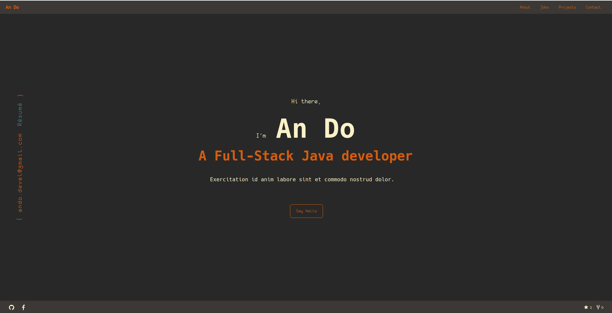

<h2 align="center">
  An Do's Portfolio and Blogs
</h2>
<p align="center">
  This project is built with <a href="https://www.gatsbyjs.org/" target="_blank">Gatsby</a> and hosted with <a href="https://www.netlify.com/" target="_blank">Netlify</a>, Check out the <a href="https://andodevel.me" target="_blank">Live Preview</a>.
</p>
<p align="center">
  <a href="https://app.netlify.com/sites/cocky-liskov-908dec/deploys" target="_blank">
    
  </a>
</p>



## 🚀 Quick start

**Install nodejs and yarn**

[nodejs](https://nodejs.org)  
[yarn](https://yarnpkg.com/)

**Install the Gatsby CLI**

```sh
yarn global add gatsby-cli
```

**Install nodejs version management nvm**

[nvm](https://github.com/nvm-sh/nvm)

```sh
nvm install
```

or add nvm hook to your _.zshrc_

```sh
export NVM_DIR="$HOME/.nvm"
[ -s "$NVM_DIR/nvm.sh" ] && \. "$NVM_DIR/nvm.sh"  # This loads nvm
[ -s "$NVM_DIR/bash_completion" ] && \. "$NVM_DIR/bash_completion"   # This loads nvm bash_completion

autoload -U add-zsh-hook
load-nvmrc() {
  local node_version="$(nvm version)"
  local nvmrc_path="$(nvm_find_nvmrc)"

  if [ -n "$nvmrc_path" ]; then
    local nvmrc_node_version=$(nvm version "$(cat "${nvmrc_path}")")

    if [ "$nvmrc_node_version" = "N/A" ]; then
      nvm install
    elif [ "$nvmrc_node_version" != "$node_version" ]; then
      nvm use
    fi
  elif [ "$node_version" != "$(nvm version default)" ]; then
    echo "Reverting to nvm default version"
    nvm use default
  fi
}
add-zsh-hook chpwd load-nvmrc
load-nvmrc
```

**Install dependencies**

```sh
yarn install
```

**Start the development server**

```sh
yarn start
```

## 💫 Production build and deployment

**Build**

```sh
yarn build
```

**Preview**

```sh
yarn serve
```

**Optional deyployment to Netlify**

[](https://app.netlify.com/start/deploy?repository=https://github.com/andodevel/gatsby-folio)

## 🧐 What's inside?

I will guide you through some parts that you need to custom your own verson of this project. For generic (Gatsby Project Structure)(https://www.gatsbyjs.org/docs/gatsby-project-structure/), please check out the link.

    .
    ├── node_modules
    ├── src
    ├── .gitignore
    ├── .prettierrc
    ├── gatsby-browser.js
    ├── gatsby-config.js
    ├── gatsby-node.js
    ├── gatsby-ssr.js
    ├── LICENSE
    ├── package-lock.json
    ├── package.json
    └── README.md

1.  **`/dir`**

Explaination ---

2.  **`/file.js`**:

Explaination ---

## 🌈 Color scheme

I use [gruvbox](https://github.com/morhetz/gruvbox) as my color scheme

**Dark mode**

| Color   | Hex                                                                |
| ------- | ------------------------------------------------------------------ |
| bg      |  `#282828` |
| bg0_h   |  `#1d2021` |
| bg0_s   |  `#32302f` |
| bg0     |  `#282828` |
| bg1     |  `#3c3836` |
| bg2     |  `#504945` |
| bg3     |  `#665c54` |
| bg4     |  `#7c6f64` |
| fg      |  `#ebdbb2` |
| fg0     |  `#fbf1c7` |
| fg1     |  `#ebdbb2` |
| fg2     |  `#d5c4a1` |
| fg3     |  `#bdae93` |
| fg4     |  `#a89984` |
| red1    |  `#cc241d` |
| red2    |  `#fb4934` |
| green1  |  `#98971a` |
| green2  |  `#b8bb26` |
| yellow1 |  `#d79921` |
| yellow2 |  `#fabd2f` |
| blue1   |  `#458588` |
| blue2   |  `#83a598` |
| purple1 |  `#b16286` |
| purple2 |  `#d3869b` |
| aqua1   |  `#689d6a` |
| aqua2   |  `#8ec07c` |
| gray1   |  `#a89984` |
| gray2   |  `#928374` |
| gray3   |  `#928374` |
| orange1 |  `#d65d0e` |
| orange2 |  `#fe8019` |

**Light mode**

_Not support yet_

## 👓 Inspiration

This project gets heavily insprired by  
[typings.gg](https://typings.gg/)  
[Brittany Chiang's portfolio](https://brittanychiang.com/)

## 🦄 Forking this repo

Feel free to fork this repo and change it to whatever you want. If you want to give me a credit, please just give a link back to my website [https://andodevel.me](https://andodevel.me).  
Happy coding 💻!
